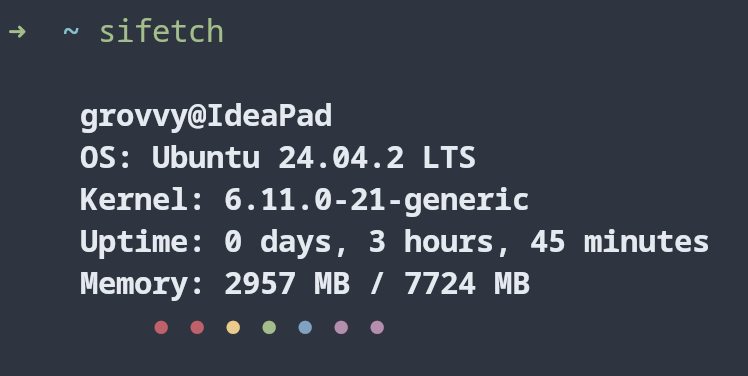

## 🖥️ sifetch — A Minimal System Info Tool in C

**sifetch** is a clean and minimal system information fetcher for your terminal, written in C.  
Inspired by the aesthetics of `neofetch` and `pfetch`, but without the bloat. Quick to run, easy to build, and visually satisfying.

---

### 📸 Example Output



---

### 🚀 Features

- 🧑‍💻 Shows username and hostname
- 🐧 Detects and displays Linux distro
- ⏳ Uptime with human-readable formatting
- 📊 Memory usage
- ⚙️ CPU model name
- 🎨 Simple colored terminal output
- 💡 No dependencies — just C and your terminal

---

### 🛠️ How to Install & Use

#### 🔧 Requirements
- C compiler (e.g. `gcc`)
- Linux-based system (or WSL on Windows)

#### 🧪 Build

```bash
git clone https://github.com/grovvysarthak/sifetch.git
cd sifetch
gcc main.c -o sifetch
```

#### ▶️ Run

```bash
./sifetch
```

You can also move it to your local bin to run from anywhere:

```bash
sudo mv sifetch /usr/local/bin/
sifetch
```

### 🧾 License

[](https://www.gnu.org/licenses/gpl-3.0)

This project is licensed under the **GNU General Public License v3.0**.

---

### 🤝 Connect With Me

- 🐦 Twitter: [@grovvysarthak](https://x.com/grovvysarthak)
- 📧 Email: [sarthakbaranwal011@proton.me](mailto:sarthakbaranwal011@proton.me)

